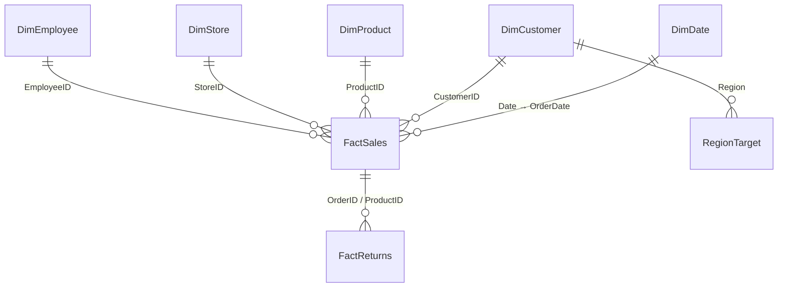

# 🛍️ TATA CLIQ — E-Commerce Sales, Customer & Product Analytics (Power BI)


An end-to-end **Power BI analytics solution** for a TATA CLIQ-style e-commerce business — covering sales performance, profitability, customer behaviour, product trends, returns and delivery efficiency. Built on a clean **star-schema semantic model** with a layered **DAX measure strategy** for scalability and maintainability.

---

## 📌 Project Overview

| | |
|---|---|
| **Report name** | TATA CLIQ Analytics Dashboard |
| **Tool** | Microsoft Power BI Desktop / Service |
| **Business scope** | Sales, Profitability, Customers, Products, Returns, Delivery |
| **Model type** | Star Schema (Dimension → Fact) |
| **Report pages** | 3 (Executive Dashboard · Sales vs Target · Executive Table View) |
| **Core fact grain** | One row per Order line (`OrderID` + `ProductID`) |

This repository contains the Power BI project file, the underlying dataset, and full documentation (architecture, DAX strategy, and a user guide) so the report can be understood, maintained, or extended by anyone picking it up.

---

## 📂 Repository Contents

```
├── TATA_CLIQ.pbix                                     # Power BI Desktop report & data model
├── E-Commerce_Business_Intelligence_&_Customer_Analytics.xlsx   # Source dataset (facts + dimensions)
├── TATA_CLIQ_Data_Architecture_DAX_Strategy.pdf        # Data model, schema & DAX strategy reference
├── TATA_CLIQ_PowerBI_User_Guide.pptx                   # End-user guide (navigation, filters, KPI glossary)
└── README.md                                           # You are here
```

---

## 🗂️ Data Model

The model follows a **star schema**: dimension tables filter two fact tables, with all measures calculated from the facts using DAX.

| Table | Type | Description | Rows |
|---|---|---|---|
| `FactSales` | Fact | Core order-line transactions — sales, cost, profit, quantity, delivery | ~50,000 |
| `FactReturns` | Fact | Return transactions linked to orders/products | ~2,460 |
| `DimCustomer` | Dimension | Customer demographics, region, state, city, segment | ~3,000 |
| `DimProduct` | Dimension | Product, category, sub-category, brand, pricing | 200 |
| `DimStore` | Dimension | Store, region, state, city | 30 |
| `DimEmployee` | Dimension | Employee, department, region | 50 |
| `DimDate` | Dimension | Full calendar hierarchy — year, quarter, month, week, day | ~912 |
| `SalesTargets` / `RegionTarget` | Target | Monthly/regional sales & profit targets for benchmarking | 750 |

### Key Columns

<details>
<summary><b>FactSales</b></summary>

`OrderID` · `OrderDate` · `CustomerID` · `ProductID` · `StoreID` · `EmployeeID` · `Quantity` · `DiscountPct` · `SalesAmount` · `CostAmount` · `Profit` · `OrderStatus` · `ShippingMethod` · `DeliveryDays` · `DeliveryDate` · `LateDelivery` · `ReturnFlag`
</details>

<details>
<summary><b>FactReturns</b></summary>

`ReturnID` · `OrderID` · `ProductID` · `CustomerID` · `ReturnDate` · `ReturnReason` · `ReturnQuantity`
</details>

<details>
<summary><b>DimCustomer</b></summary>

`CustomerID` · `CustomerName` · `Gender` · `Age` · `Region` · `State` · `City` · `CustomerSegment`
</details>

<details>
<summary><b>DimProduct</b></summary>

`ProductID` · `ProductName` · `Category` · `SubCategory` · `Brand` · `UnitPrice` · `UnitCost`
</details>

<details>
<summary><b>DimStore / DimEmployee / DimDate / SalesTargets</b></summary>

- **DimStore**: `StoreID` · `StoreName` · `Region` · `State` · `City`
- **DimEmployee**: `EmployeeID` · `EmployeeName` · `Department` · `Region`
- **DimDate**: `Date` · `Year` · `Quarter` · `Month` · `MonthNumber` · `Week` · `Day` · `DayName` · `FinancialYear`
- **SalesTargets**: `Month` · `Region` · `Category` · `TargetSales`
</details>

### Entity Relationship Diagram



**Relationship rules:** single-direction filtering (Dimension → Fact), 1:* cardinality, cross-filter direction kept **Single** unless a specific business requirement needs Both.

---

## 📊 Report Pages

### 1️⃣ Executive Dashboard
The landing page — KPI cards plus 9 supporting visuals, all responsive to the page's slicers.

**KPI Cards:** Total Sales · Total Profit · Total Orders · Total Customers · Profit Margin % · Return Rate % · YTD Sales · Sales Growth % · Avg. Order Value · VIP Customers · Late Delivery % · Avg. Delivery Days

**Charts:**
| Visual | Chart type | Insight |
|---|---|---|
| Profit by Year / Month | Donut & Line | Where profit concentrates and trends monthly |
| Profit by Region | Combo | Regional profit with trend overlay |
| Profit by State | Waterfall | State-level profit contribution |
| Category → Sub-Category Profit | Funnel | Profit drop-off across the category tree |
| Orders by Month & Year | Stacked Area | Order volume trend by year |
| Orders by City & Region | Stacked Column Combo | City-level order volume by region |
| Orders by Brand | Pie | Brand share of total orders |
| Orders by Department & Category | Clustered Bar | Department performance by category |
| Total Sales by Region | 100% Stacked Bar | Regional share of sales |
| Top 10 Products by Sales | Clustered Column | Best-selling products |

**Slicers:** Year · Month · Region · State/City · Product Category

### 2️⃣ Sales vs Target
Benchmarks actuals against `RegionTarget` goals, region by region — via a pivot table, a combo chart (actual columns vs. target lines), and a map sized by Total Sales.

### 3️⃣ Executive Table View
A flat, exportable row-level detail table — `Customer ID` · `Customer Name` · `Product ID` · `Product Name` · `Store State` · `Store ID` · `Total Sales` · `Total Quantity` — for spot-checks and ad-hoc export to Excel/CSV.

---

## 🧮 DAX Measures

Measures are organised into layers to keep the model reusable and maintainable.

| Layer | Purpose |
|---|---|
| 1. Base measures | Atomic aggregates: Sales, Cost, Quantity, Orders, Customers, Returns |
| 2. Profitability | Profit & Margin built from base measures |
| 3. Time intelligence | YTD, prior-period & growth via a marked Date table |
| 4. Ratios | `DIVIDE()` everywhere to avoid divide-by-zero errors |
| 5. Ranking | `RANKX` for Top-N products/customers |
| 6. Targets | Actuals vs. target kept separate; variance & achievement % derived |
| 7. Filter-aware metrics | `CALCULATE()` used deliberately; `ALL()` used sparingly |
| 8. Presentation | Currency/percentage formatting handled at the measure level |

### Core Measures

```dax
Total Sales      = SUM ( FactSales[SalesAmount] )
Total Cost       = SUM ( FactSales[CostAmount] )
Total Profit     = [Total Sales] - [Total Cost]
Total Quantity   = SUM ( FactSales[Quantity] )
Total Orders     = DISTINCTCOUNT ( FactSales[OrderID] )
Total Customers  = DISTINCTCOUNT ( FactSales[CustomerID] )

Profit Margin %  = DIVIDE ( [Total Profit], [Total Sales] )
Return Rate %    = DIVIDE ( [Returned Orders], [Total Orders] )
Avg. Order Value = DIVIDE ( [Total Sales], [Total Orders] )
Sales Growth %   = DIVIDE ( [Total Sales] - [Prior Sales], [Prior Sales] )
YTD Sales        = TOTALYTD ( [Total Sales], DimDate[Date] )

Late Delivery %  = DIVIDE ( [Late Deliveries], [Total Orders] )
Avg. Delivery Days = AVERAGE ( FactSales[DeliveryDays] )
```

### Target / Variance Measures

```dax
Target Sales          = SUM ( RegionTarget[TargetSales] )
Target Profit         = SUM ( RegionTarget[TargetProfit] )
Sales Variance         = [Total Sales]  - [Target Sales]
Sales Achievement %    = DIVIDE ( [Total Sales],  [Target Sales] )
Profit Variance        = [Total Profit] - [Target Profit]
Profit Achievement %   = DIVIDE ( [Total Profit], [Target Profit] )
```

> ⚠️ Validate exact physical column names against the live PBIX Model view before reusing these patterns in another build — they represent the implementation pattern, not a guarantee of identical column names in every environment.

---

## 📖 KPI Glossary

| Metric | Definition |
|---|---|
| **Total Sales** | Sum of all sales value across selected filters |
| **Total Profit** | Sales minus cost |
| **Profit Margin %** | Total Profit as a % of Total Sales |
| **Total Orders** | Count of distinct orders placed |
| **Return Rate %** | Returned orders as a % of total orders |
| **Avg. Order Value** | Total Sales ÷ Total Orders |
| **Avg. Delivery Days** | Average time between order and delivery |
| **Late Delivery %** | Share of orders delivered after the expected date |
| **Sales Growth %** | Change in sales vs. the prior comparable period |
| **VIP / High Value Customers** | Customers meeting a defined high-spend threshold |

---

## 🚀 Getting Started

### Prerequisites
- [Power BI Desktop](https://powerbi.microsoft.com/desktop/) (latest version recommended)
- Access to the source Excel workbook (included) or your own SQL/CSV source

### Setup
1. Clone this repository.
2. Open `TATA_CLIQ.pbix` in Power BI Desktop.
3. **Home → Transform data** to review/refresh the Power Query source pointing at the Excel workbook.
4. Refresh the model — dimensions load first, then `FactSales` and `FactReturns`.
5. Explore the three report pages: **Executive Dashboard → Sales vs Target → Executive Table View**.

### Publishing to Power BI Service
1. **Home → Publish** to your target workspace.
2. In `app.powerbi.com`, open the dataset and set up **Scheduled Refresh** (after confirming a manual refresh succeeds).
3. Optionally bundle the report into a **Power BI App** for controlled navigation, and use **Share** for direct access.

Full navigation, filter, and refresh instructions are in `TATA_CLIQ_PowerBI_User_Guide.pptx`.

---

## 🏗️ Architecture

```
Source (Excel) → Power Query → Star Schema → DAX Semantic Layer → Power BI Report → Power BI Service
```

- Dimensions filter facts; filter direction kept single (Dimension → Fact).
- Reusable, layered measures instead of repeated inline aggregations.
- A dedicated marked Date table drives all time-intelligence calculations.

See `TATA_CLIQ_Data_Architecture_DAX_Strategy.pdf` for the complete architecture reference, relationship matrix, and validation checklist.

---

## ✅ Deployment Checklist

- [ ] Publish PBIX to the correct workspace
- [ ] Confirm semantic model refresh succeeds
- [ ] Configure gateway/credentials if an on-premises source is used
- [ ] Enable scheduled refresh only after a successful manual refresh
- [ ] Validate Row-Level Security (RLS) if applicable
- [ ] Publish via a Power BI App for business users
- [ ] Test filters, totals and exports in the Service before sharing

---

## 📄 License

This project is provided for portfolio and educational purposes. Feel free to fork and adapt with attribution.

---

## 🙋 Author

Built and documented as a Power BI portfolio project — sales, profitability, customer and product analytics for a TATA CLIQ-style e-commerce dataset.

⭐ If you found this useful, consider starring the repo!
